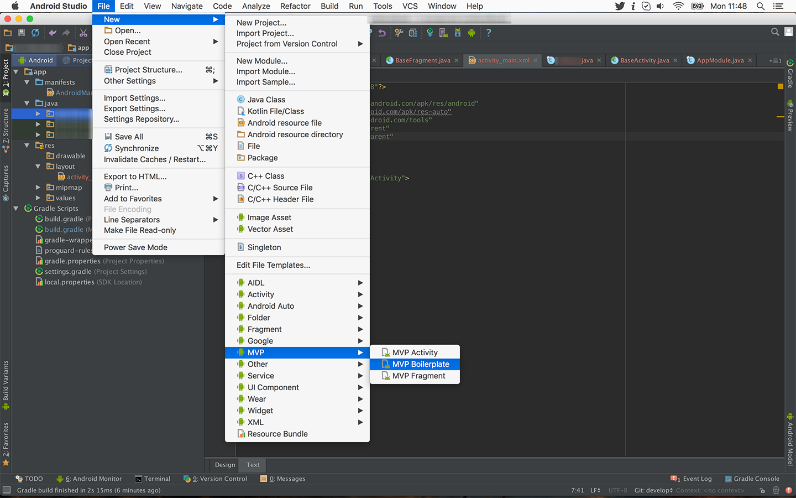

# Android Studio Helpers

This repo has some Gradle helpers to speed up adding common libraries.

In the settings folder is jar version of the open source [Novoda settings](https://medium.com/sebs-top-tips/share-the-settings-with-the-whole-team-android-studio-protip-6-3cce16eb2ea4#.wlu8xdrn6) for Android Studio.

This is an Android Studio template for MVP. 

This version is a fork from [Android-Studio-MVP-template](https://github.com/benoitletondor/Android-Studio-MVP-template) and follows [Paul Blundell](https://www.novoda.com/blog/better-class-naming/) suggestions on naming classes for the MVP architecture. 

Here's the hierarchy it follows:

```
com.company.app
    +-- injection
    |   - AppComponent
    |   - AppModule
    +-- model
    |   - MainActivityModel
    +-- presenter
    |   - MainActivityMVP
    |   - MainActivityPresenter
    +-- view
    |   - MainActivity
    | - YourApp
```

## Prerequisites

You must use [Dagger 2](http://google.github.io/dagger/) for dependency injection and `AppCompat` for annotations and base classes.

## Installation

#### For Mac:

Just copy all 3 directories `MVPFragment`, `MVPActivity` and `MVPBoilerplate` to `$ANDROID_STUDIO_FOLDER$/Contents/plugins/android/lib/templates/activities/`

#### For Windows:

Just copy all 3 directories `MVPFragment`, `MVPActivity` and `MVPBoilerplate` to `$ANDROID_STUDIO_FOLDER$\plugins\android\lib\templates\activities\`

## How to use

#### 1. Generate base boilerplate

First of all, create the base hierarchy and classes using `MVP Boilerplate` from the **root package folder**. This needs to be done only once per project:



It will generate an `App` class that you should use as your Application, an `AppModule` and a `AppComponent` for injection.

> Be sure to use the generated `App` as your Application into your manifest!

#### 2. Create your first activity

Then you can create a new `MVP Activity`. It will create:

- An `Activity`
- A layout for your Activity based on Constraint Layout
- A `Component` and a `Module` for Dagger 2 injection
- A `View` interface for your Activity
- A `Presenter` interface and default implementation class
- An `Model` interface and default implementation class for your model

> It's important that you **create it from the root package**, otherwise it will re-create the whole MVP hierarchy under your subpackage which is not what you want.

## License

    Copyright 2016 Rene Gens

    Licensed under the Apache License, Version 2.0 (the "License");
    you may not use this file except in compliance with the License.
    You may obtain a copy of the License at

       http://www.apache.org/licenses/LICENSE-2.0

    Unless required by applicable law or agreed to in writing, software
    distributed under the License is distributed on an "AS IS" BASIS,
    WITHOUT WARRANTIES OR CONDITIONS OF ANY KIND, either express or implied.
    See the License for the specific language governing permissions and
    limitations under the License.
